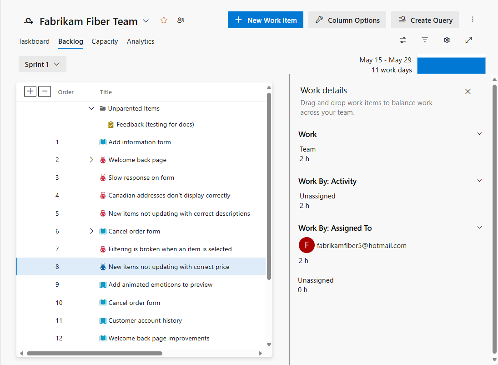
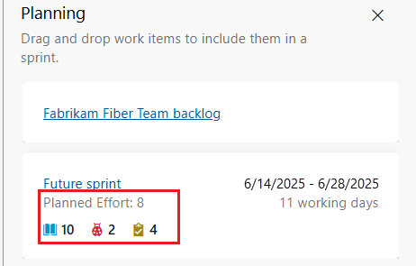

# 1. Assign backlog items to a sprint in Azure Boards
 
[!INCLUDE [version-lt-eq-azure-devops](../../includes/version-lt-eq-azure-devops.md)] 

The first step in planning your sprint is to assign work from your backlog to a sprint. Your team builds the sprint backlog during the sprint planning meeting, typically held on the first day of the sprint. Each sprint corresponds to a time-boxed interval that supports your team's ability to work using Agile processes and tools. During the planning meeting, your product owner works with your team to identify those stories or backlog items to complete in the sprint.  

> [!NOTE]   
> Your project comes with several predefined sprints. You can quickly add more sprints 
> from your backlog as needed. Or, change the dates of the predefined sprints. To learn more about sprints, also referred to as iterations, 
> see [About areas and iterations](../../organizations/settings/about-areas-iterations.md). 

Here's an example of a sprint plan that consists of backlog items and the tasks required to complete each item. By setting team capacity and estimating tasks, the team can see when the team or a team member is at, under, or over capacity.

::: moniker range="<=azure-devops"

> [!div class="mx-imgBorder"]  
> 
::: moniker-end

	
In this article you learn how to:  

> [!div class="checklist"]   
> * Open your product backlog 
> * Assign backlog items to a sprint
> * Use multi-select to bulk update work items

Planning meetings typically consist of two parts. In the first part, the team and product owner identify the 
backlog items that the team feels it can commit to completing in the sprint, based on experience with previous sprints. 
These items get added to the sprint backlog. In the second part, your team determines how it develops and tests each item. 
They then define and estimate the tasks required to complete each item. Finally, your team commits to implementing 
some or all of the items based on these estimates. 

> [!NOTE]    
> Sprint planning doesn't need to be challenging. It can be fun and a time for the entire Scrum team to build camaraderie by working together to answer the question of "What can we commit to?" For examples and strategies to keep your sprint planning focused and effective, check out the [What is Scrum?](/devops/plan/what-is-scrum).
>  
> When you complete your sprint plan, your sprint backlog should contain all the information your team needs to successfully complete work within the time allotted without having to rush at the end. 

## Prerequisites

[!INCLUDE [temp](../includes/prerequisites.md)]

## Open your team's product backlog

> [!NOTE]  
> Your sprint backlogs are one of three classes of backlogs available to you. For an overview of the features supported on each backlog and the two types of boards, see [About teams and Agile tools](../backlogs/backlogs-overview.md). 
>
> For a beginner's guide to planning and tracking work, see [Get started with Agile tools](../organizations/settings/about-teams-and-settings.md).  

::: moniker range=">= azure-devops-2020"  

From your web browser, open your product backlog. 

1. Select your project, choose **Boards** > **Backlogs**, and then select the correct team from the team selector menu. 

	> [!div class="mx-imgBorder"]  
	> 

    To select another backlog, open the selector and then choose a different team or select the **View Backlog directory** option. Or, enter a keyword in the search box to filter the list of team backlogs for the project.

	> [!div class="mx-imgBorder"]  
	>  

	> [!TIP]    
	> Choose the :::image type="icon" source="../../media/icons/icon-favorite-star.png" border="false"::: star icon to favorite a team backlog. Favorited artifacts (:::image type="icon" source="../../media/icons/icon-favorited.png" border="false"::: favorited icon) appear at the top of the team selector list. 

1. Select **Stories** (for Agile), **Issues** (for Basic), **Backlog items** (for Scrum), or **Requirements** (for CMMI) as the backlog level. 

	> [!div class="mx-imgBorder"]  
	>  

2. (Optional) To choose which columns should display and in what order, choose the  :::image type="icon" source="../../media/icons/actions-icon.png" border="false"::: actions icon and select **Column options**. For more information, see [Change column options](../backlogs/set-column-options.md). 

	> [!div class="mx-imgBorder"]  
	>  

::: moniker-end  

## Assign work from your backlog to a sprint 
   
Before you start planning your sprint, [Create and manage your backlog](../backlogs/create-your-backlog.md). 

Also, you need to [set the start and end dates for your sprint](define-sprints.md#quick-start-schedule). 

You can quickly assign work items to a sprint through drag-and-drop from the product backlog to the sprint. 

::: moniker range="<=azure-devops"

1. The next step is to open the Planning pane. Choose the :::image type="icon" source="../../media/icons/view-options-icon.png" border="false"::: view options icon and select **Planning**. While you're at it, make sure **Parents** and **Forecasting** are Off. You can choose to set **In Progress items** to On or Off. 

	> [!div class="mx-imgBorder"]
	> 

	The set of sprints selected for your team appears. If you don't see any sprints listed, you can add sprints or select existing sprints for your team's use. To learn how, see [Manage sprint timelines](define-sprints.md).   

1. You can drag and drop items from the **Backlog** onto a sprint.  

	> [!NOTE]   
	> The **Planning** pane only shows the current sprint and the next 10 future sprints in the list, even if more exist for the team. Only a team administrator or member of the **Project Administrators** group can [select iterations for a team](../../organizations/settings/set-iteration-paths-sprints.md). 

	> [!div class="mx-imgBorder"]
	> 

2. Select one or more items from the backlog and drag them to the sprint you're planning. This action updates the Iteration Path of the backlog items and any of its child tasks to the sprint you selected. 

3. Check the level of effort displayed in the sprint window. As you assign backlog items to a sprint, the sprint window updates with a running tally of the number of backlog items and tasks and the **Planned Effort**. 

	> [!div class="mx-imgBorder"]
	>    

	*Planned Effort* provides a sum of all *Story Points* or *Effort* defined for backlog items assigned to the sprint. This sum represents your initial guess at the amount of work your team completes in the sprint. Next, define tasks, estimate that work, and use your team's capacity to make sure it fits in the sprint. 

::: moniker-end

## Use the multi-select feature to modify items in bulk

Multi-select of work items on the product and sprint backlogs works in the same way as multi-select works within query results. 

With multi-select, you can complete several actions on several work items at once, such as: 

- Move to a sprint
- Change the backlog priority  
- Assign to a team member 
- Change one or more field values
- Add links
- [Map items or change the parent an item is linked to](../backlogs/organize-backlog.md#mapping)

To select several items in a sequence, hold down the shift key. To select several nonsequential items, use the Ctrl key. Then, you can either drag the selected items to a new position within the backlog, to a different sprint, or select an option from the context () or action (  :::image type="icon" source="../media/icons/actions-icon.png" border="false"::: ) menu of one of the items. 

For more information, see [Bulk modify work items](../backlogs/bulk-modify-work-items.md). 

## Next step

After you define your sprint plan, your team's ready to begin work on the sprint tasks.

> [!div class="nextstepaction"]
> [2. Add tasks](add-tasks.md)

## Related content

To add or rename the sprints your team uses, see [Define iteration paths (sprints) and configure team iterations](../../organizations/settings/set-iteration-paths-sprints.md).  

If your backlog doesn't show the work items you expect, see [Create and manage your backlog](../backlogs/create-your-backlog.md). 
