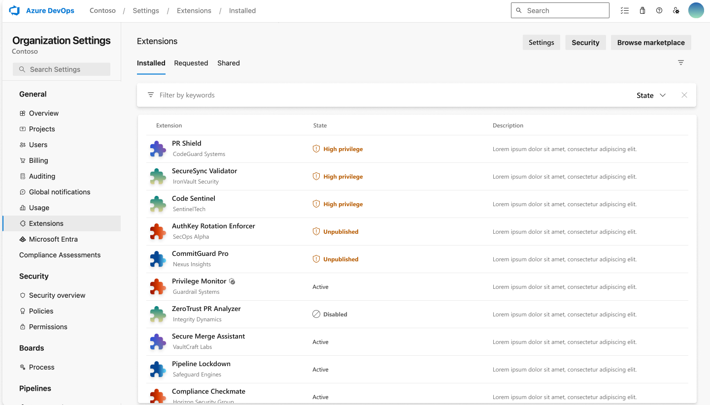
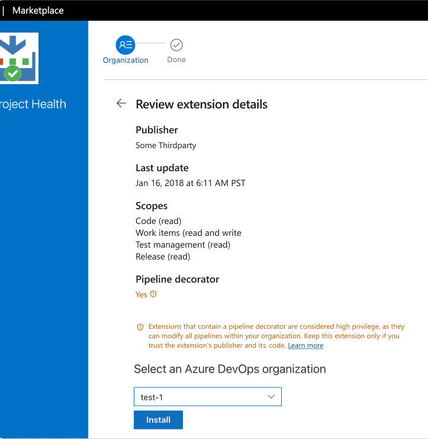

# Manage high privilege scopes, pipeline decorators, and unpublished extensions

Extensions in Azure DevOps enhance functionality and streamline workflows, but some extensions might pose security vulnerabilities due to their high privilege scopes or unpublished status. This article explains how to identify and manage high privilege, pipeline decorators, and unpublished extensions to protect your Azure DevOps organization from potential security vulnerabilities or unexpected behavior.

## What are high privilege scopes and high privilege extensions?

### High privilege scopes

Scopes determine in general which resources an extension can access and the operations permitted to perform on those resources. Extensions might use multiple scopes.

As for what is defined as a high privilege scope, it's a scope that is overly permissive.

For example a high privilege scope can:
- Read, update, and delete your source code
- Read, write, and manage your identities and groups
- Create, read, update, and delete your projects

For the full list of scopes, including the high privilege scopes, see the [Manifest reference](../extend/develop/manifest.md#scopes).

### High privilege extensions

High privilege extensions make use of one or more high privilege scopes. As high privilege extensions can access sensitive resources and perform critical operations, it's essential to evaluate them carefully to ensure they align with your organization's security and operational standards.

When it comes to any extension, and even more a high privilege extension, consider the following elements:
- **Trusted publisher**: Install and use extensions only if you trust their code and publisher
- **Review the requested scopes**: Ensure the requested scopes are necessary for the extension's functionality
- **Limit usage**: Install high privilege extensions only if they're critical to your workflows

## Evaluate the usage of high privilege scopes in Azure DevOps extensions

Few of your already installed extensions might be flagged for high privilege scope usage. You can check their state in the **Extensions** section of **Organization settings**.

We recommend that you only install, update, or use extensions if you trust their code and their publishers.

Microsoft runs virus scans on each new and updated version of an extension; yet this feature only highlights in the user interface whether a specific extension uses high privilege scopes. For more information on the virus scans, see [Publish your extension](../extend/publish/overview.md#publish-your-extension).

> [!div class="mx-imgBorder"]  
> 

## Manage extensions with high privilege scopes

If you identify an extension with high privilege scopes, assess whether the called scopes from the extension are essential for your use case. If the extension's functionality doesn't justify the scopes, we recommend not installing or using the extension to safeguard your Azure DevOps organization.

> [!div class="mx-imgBorder"]  
> 

The Visual Studio Marketplace for Azure DevOps extensions provides similar indications to those extensions shown in the admin page for high privilege scopes. So you can also identify high privilege scopes flagged in the [Azure DevOps Visual Studio Marketplace](https://marketplace.visualstudio.com/azuredevops) before the extension is installed in your organization. 

When you select any extension and especially an extension with high privilege scopes, think critically whether the extension's functionality justifies the use of these scopes. Only proceed with installation if you trust the publisher and the extension's code.

> [!div class="mx-imgBorder"]  
> 

## Use pipeline decorators safely

[Pipeline decorators](../extend/develop/add-pipeline-decorator.md) are private extensions that modify and enhance all pipelines within your organization, they're also classified as high privilege extensions. Use pipeline decorator extensions cautiously and only if you trust their publishers and code.

> [!div class="mx-imgBorder"]  
> 

## Discontinue use of unpublished extensions

Beyond high privilege extensions, the extension's administration page visually indicates whether an extension has been unpublished by its publisher.

When an extension is unpublished from the [Visual Studio Marketplace](https://marketplace.visualstudio.com/) by its publisher, it typically signifies that the extension is no longer maintained.

Discontinue the use of unpublished extensions by uninstalling them from your Azure DevOps organization.

Additionally, with the Azure DevOps Services REST API [version 7.2](/rest/api/azure/devops/extensionmanagement/installed-extensions/list?view=azure-devops-rest-7.2&tabs=HTTP#extensionstateflags&preserve-view=true), the string field `unpublished` is now available. This field enables you to programmatically identify extensions that are unpublished from the Visual Studio Marketplace. And for example, you can build your own process of detecting and managing unpublished extensions within your Azure DevOps organization.

## Related articles

- [Secure your Azure DevOps environment](../organizations/security/security-overview.md)
- [Publish extensions to the Visual Studio Marketplace](../extend/publish/overview.md)
- [Add pipeline decorators](../extend/develop/add-pipeline-decorator.md)
- [Reference the extension manifest](../extend/develop/manifest.md)