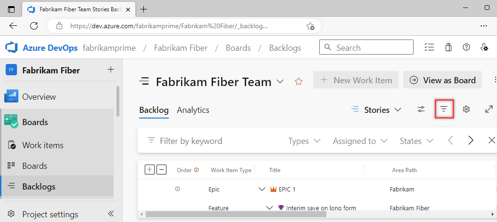

# Filter lists, boards, and directories 

[!INCLUDE [version-lt-eq-azure-devops](../../includes/version-lt-eq-azure-devops.md)] 

Several applications and pages in Azure DevOps support filtering, which is useful when dealing with a large number of artifacts or items. Most directory views offer one or more filter functions to help you quickly find what you're looking for.

You can filter most items using keywords or a user name, either for the author of an item or where work is assigned to them. Filtering can be applied to lists and boards in the following areas:

- **Git repositories:** Branches, Commits, Commit history, Pull Requests, Pushes, and Repositories  
- **Work tracking:** Work Items, Boards, Backlogs, Sprint Backlogs, and Taskboards 
- **Directories:** Dashboards, Boards, Backlogs, Sprints, Queries, Builds, Releases  

> [!NOTE]   
> You might have fewer or other filter options based on the [enabled features](preview-features.md) or the platform and version that you're working from.

## Prerequisites

| Category | Requirements |
|--------------|-------------|
|**Permissions**|Member of the **Contributors** group or similar permissions. |
|**Access**| - Member of the project where you want to apply filters. If you don't have access, request it from your project administrator. - At least **Basic** access to use filtering features. Users with Stakeholder access might experience limited filtering capabilities.|

## Filter based on keywords, tags, or fields

To turn on filtering, choose the :::image type="icon" source="../../media/icons/filter-icon.png" border="false"::: filter icon. 

You can filter work items by entering a keyword or using fields like work item type, assigned to, state, and tags. The filter lists work items based on any visible column or field, including tags. You can also enter an ID value, regardless of the visibility of the ID field.

The filtered set is always a flat list, even if you selected to show parents. 

### Characters ignored by keyword filter criteria

The filter criteria ignore the following characters: `,` (comma), `.` (period), `/` (forward slash), and `\` (back slash).

## Filter directories

Choose the :::image type="icon" source="../../media/icons/filter-icon.png" border="false"::: filter icon to filter a directory list by keyword, team, or other supported field. Keywords apply to titles, descriptions, and team names. 

For example, here we turn on filtering for the dashboard directory. 

> [!div class="mx-imgBorder"]  
>    

## Related articles  
- [Commit history](../../repos/git/commit-history.md)
- [Working with Git tags](../../repos/git/git-tags.md)
- [Filter backlogs and queries](../../boards/backlogs/filter-backlogs-boards-plans.md)
- [Filter your board](../../boards/backlogs/filter-backlogs-boards-plans.md)
- [Add tags to work items](../../boards/queries/add-tags-to-work-items.md)