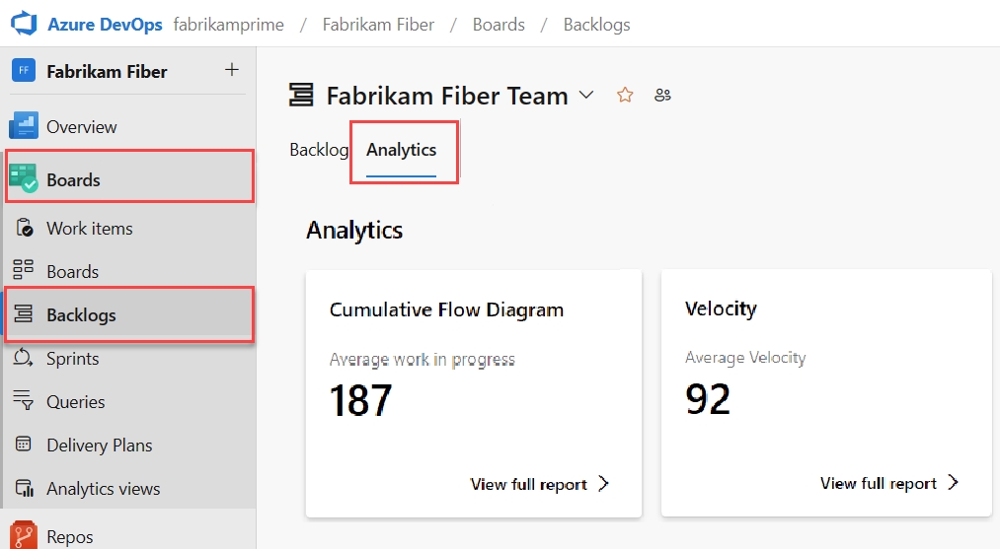
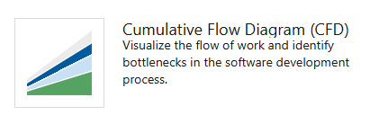

# View and configure a Cumulative Flow Diagram

[!INCLUDE [version-lt-eq-azure-devops](../../includes/version-lt-eq-azure-devops.md)]

::: moniker range="<=azure-devops"

You use cumulative flow diagrams (CFD) to monitor the flow of work through a system. There are two CFD charts: the in-context report you can view from a team backlog or board and the CFD widget you can add to a dashboard. 

::: moniker-end

::: moniker range=">= azure-devops-2020" 

CFDs help teams monitor the count of work items as they progressively move through various workflow states. These diagrams can show the flow of epics, features, user stories, issues, product backlog items, or requirements, depending on the process selected for your project:
- [Agile](../../boards/work-items/guidance/agile-process.md)
- [Basic](../../boards/get-started/plan-track-work.md)
- [Scrum](../../boards/work-items/guidance/scrum-process.md)
- [Capability Maturity Model Integration (CMMI)](../../boards/work-items/guidance/cmmi-process.md)

::: moniker-end

::: moniker range=">= azure-devops-2020" 

Use this article to learn how to: 

> [!div class="checklist"] 
> * Configure the Cumulative Flow Diagram widget (Analytics)
> * View and configure the CFD in-context report (Analytics)   

::: moniker-end

The CFD shows the count of items in each column for the selected time period. From this chart, you can gain an idea of the amount of work in progress and lead time. Work in progress counts unfinished requirements. Lead time indicates the amount of time it takes to complete a requirement once work has started. 

::: moniker range=">= azure-devops-2020" 

> [!div class="mx-imgBorder"]
>  

::: moniker-end

::: moniker range="<=azure-devops"
> [!NOTE]  
> The in-context report always uses the blue-green color theme. However, the [Analytics-based Cumulative flow diagram widget](#cfd-widget) provides support for choosing different color themes. 

::: moniker-end

For the CFD to provide useful information, you'll want to update the status of work items to reflect progress as it occurs. You can quickly make these updates through your [board](../../boards/boards/kanban-quickstart.md). 

For usage guidance, see [Cumulative flow, lead time, and cycle time guidance](cumulative-flow-cycle-lead-time-guidance.md).

## Prerequisites

[!INCLUDE [temp](../includes/analytics-widgets-prerequisites.md)]

## Open your backlog from the web portal

::: moniker range=">= azure-devops-2020" 

1. Check that you selected the right project, and select **Boards** > **Backlogs**. Then select the correct team from the team selector menu. 

    > [!div class="mx-imgBorder"]  
    > 

    To select another backlog, open the selector and then select a different team or select the **View Backlog directory** option. Or, enter a keyword in the search box to filter the list of team backlogs for the project.

    > [!div class="mx-imgBorder"]  
    >  

1. To view the in-context reports for the product backlog, check that you selected **Stories** for Agile, **Issues** for Basic, **Backlog items** for Scrum, or **Requirements** for CMMI as the backlog level. Or

    > [!div class="mx-imgBorder"]  
    >  

::: moniker-end

## View the CFD in-context report   

::: moniker range=">= azure-devops-2020" 

CFD reports are available for each backlog level, both product and portfolio backlogs. Each report provides interactive controls to provide each user the view of interest to them.  

1. You open the CFD for your product or portfolio backlog by choosing **Analytics**. 

	> [!div class="mx-imgBorder"]  
	> 

	The Average work in progress value excludes completed work items. 

1. To select a portfolio backlog, select it from the backlog selector menu.   

    > [!div class="mx-imgBorder"]  
    >  

1. Next, select **View full report** for the Cumulative Flow Diagram.  

1. Use the interactive controls to select the time frame, swimlanes, and workflow states or board columns. You can select a rolling period of 14 days or up to 180 days.  

	Hover over a point in time to show how many work items are in a particular state. The default setting for the Cumulative Flow Diagram-Average work in progress includes completed work items since the team started tracking work. 

	For example, On July 3, 101 items were in a Research state.

	> [!div class="mx-imgBorder"]  
	> 

	The selections you make are only set for you, and persist across sessions until you change them. 

1. To add the report to a dashboard, select the :::image type="icon" source="media/icons/actions-icon.png" border="false"::: actions icon and select **Copy to Dashboard**.

	> [!div class="mx-imgBorder"]  
	>  
	
	Select the dashboard and select **OK**.  

1. To return to the Analytics summary, select the :::image type="icon" source="../../media/icons/back-arrow.png" border="false":::back arrow.

::: moniker-end

  

  

::: moniker range="<=azure-devops"

## Add the Cumulative Flow Diagram widget to your dashboard   

::: moniker-end

::: moniker range=">= azure-devops-2020" 

1. If you haven't yet configured your board, do that now. Define the [columns](../../boards/boards/add-columns.md) and [swimlanes](../../boards/boards/expedite-work.md) that support your workflow processes.  
1. If you want fixed scope CFD charts, make sure that you've [defined the sprint iterations](../../boards/sprints/define-sprints.md) for those sprints of interest.  
1. To add a CFD chart to your team dashboard, see [Add a widget to a dashboard](./add-widget-to-dashboard.md). Add the Cumulative Flow Diagram widget.  

	  

1. Select the :::image type="icon" source="../media/icons/actions-icon.png" border="false"::: actions icon and select the **Configure** option to open the configuration dialog. Modify the title, and then select the values you want to monitor:
   - Team
   - Backlog level
   - Swimlanes
   - Time period

    :::image type="content" source="media/cfd-configure.png" alt-text="Configure CFD chart":::
::: moniker-end

 
 

::: moniker range="<=azure-devops"

## Configure the CFD widget    

1. For a continuous flow diagram, select Rolling period and specify the number of days you want to view on the chart.  

	Or, for a fixed scope view, select and specify the Start date. Select this view if your team employs a Scrumban process or follows a standard sprint process.  

	The main difference between these two types of CFD charts is that the fixed scope CFD will provide information (in most cases) of scope change.   

1. Select the color. You can distinguish the CFD for different teams by choosing different colors.

2. Select **Save** when done. The following image shows an example CFD chart showing 30 days of data. 
   
    :::image type="content" source="media/cfd-exampe-rolling-30-days.png" alt-text="Example CFD chart, rolling 30 days":::
::: moniker-end

## Next steps

> [!div class="nextstepaction"]
> [Cumulative flow, lead time, and cycle time guidance](cumulative-flow-cycle-lead-time-guidance.md)

## Related articles

- [Add columns](../../boards/boards/add-columns.md)
- [Add swimlanes](../../boards/boards/expedite-work.md) 
- [Widget catalog](widget-catalog.md)
- [Marketplace widgets](https://marketplace.visualstudio.com/search?term=widget&target=VSTS&category=All%20categories&sortBy=Relevance)

