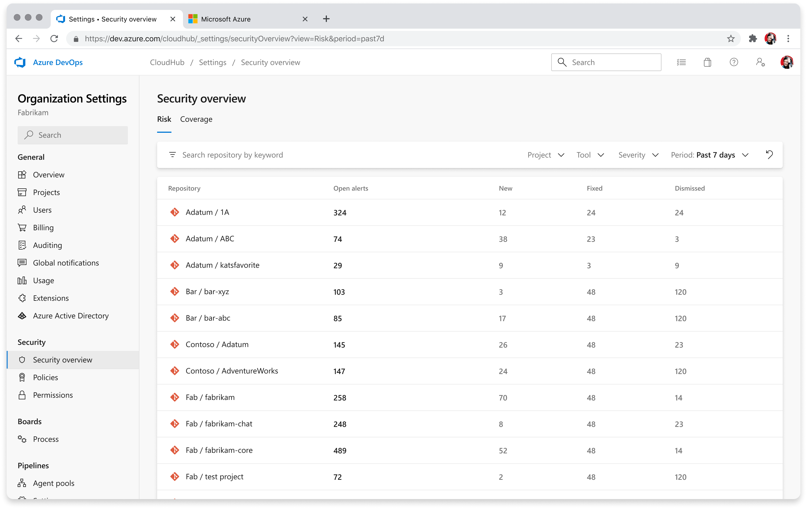
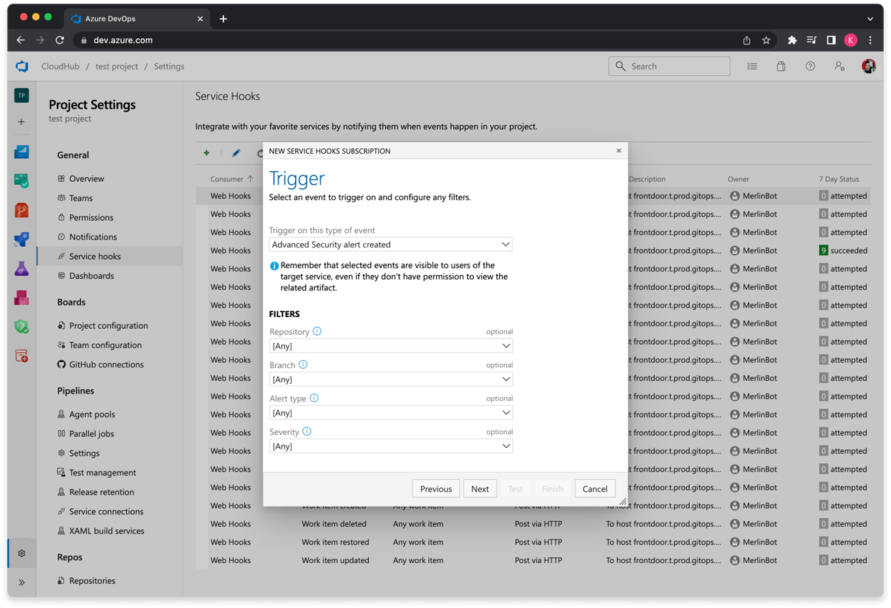

### Security overview risk page enhanced with new columns and filtering options

Under the **Risk** tab, you'll find newly added columns displaying new, fixed, and dismissed security alerts across your organization. We’ve added  filtering options to refine results by project, tool (secrets, dependencies, or code scanning results), and a time-based filter to define search boundaries.

Additionally, applying a filter adds a URL query parameter, enabling you to share the pre-filtered view with others in your organization.

> [!div class="mx-imgBorder"]
> [](../../media/253-ghazdo-01.png#lightbox)


### Multi-repository publishing scenarios supported for GitHub Advanced Security for Azure DevOps

Previously, when a pipeline definition was housed in one repository and the source code to be scanned by GitHub Advanced Security was in another, results were processed and submitted to the wrong repository. Instead of publishing alerts to the repository with the source code, they appeared in the repository where the pipeline was defined.

Now, both dependency scanning and code scanning correctly route alerts to the repository containing the scanned source code in multi-repository scenarios.

To enable this feature, set the pipeline environment variable `advancedsecurity.publish.repository.infer: true` to infer the repository to publish from the repository in the working directory. 

Alternatively, if you don't explicitly check out a repository or use an alias to check out your repository, utilize the variable `advancedsecurity.publish.repository: $[ convertToJson(resources.repositories['YourRepositoryAlias']) ]` instead.

YAML code snippet:


```yaml
  trigger:
  - main

resources:
  repositories:
    - repository: BicepGoat
      type: git
      name: BicepGoat
      ref: refs/heads/main
      trigger:
        - main

jobs:
  # Explicit - `advancedsecurity.publish.repository` explicitly defines the repository to submit SARIF to.
  - job: "AdvancedSecurityCodeScanningExplicit"
    displayName: "🛡 Infrastructure-as-Code Scanning (Explicit)"
    variables:
      advancedsecurity.publish.repository: $[ convertToJson(resources.repositories['BicepGoat']) ]
    steps:
      - checkout: BicepGoat
      - task: TemplateAnalyzerSarif@1
        displayName: Scan with Template Analyzer
      - task: AdvancedSecurity-Publish@1
        displayName: Publish to IaC Scanning Results to Advanced Security


  # Infer - `advancedsecurity.publish.repository.infer` specifies that the `AdvancedSecurity-Publish` must
  # infer repository to submit SARIF to from the working directory on the build agent.
  - job: "AdvancedSecurityCodeScanningInfer"
    displayName: "🛡 Infrastructure-as-Code Scanning (Infer)"
    variables:
      advancedsecurity.publish.repository.infer: true
    steps:
      - checkout: BicepGoat
      - task: TemplateAnalyzerSarif@1
        displayName: Scan with Template Analyzer
      - task: AdvancedSecurity-Publish@1
        displayName: Publish to IaC Scanning Results to Advanced Security
```

### Service hooks for GitHub Advanced Security for Azure DevOps alerts (preview) 

You can now configure service hooks for GitHub Advanced Security alert events, including:

* New alert created 
* Alert data changed
* Alert state changed 

Just like other repository events, you can filter by repository and branch. For alerts specifically, you can filter by alert type (dependencies, code scanning, or secrets) and alert severity.

> [!div class="mx-imgBorder"]
> [](../../media/253-ghazdo-02.png#lightbox)

To participate in the preview, fill out the [preview interest form](https://aka.ms/ghazdo-service-hooks-preview) or send us an [email](mailto:ghazdopreview@microsoft.com)!

### pnpm v9 support comes to GitHub Advanced Security for Azure DevOps dependency scanning

With pnpm v8 reaching end-of-life at the end of April, the next dependency scanning update will include support for pnpm v9. This update is in response to your [Developer Community](https://developercommunity.visualstudio.com/t/AdvancedSecurity-Dependency-Scanning1-T/10743452) request for pnpm v9 support.

